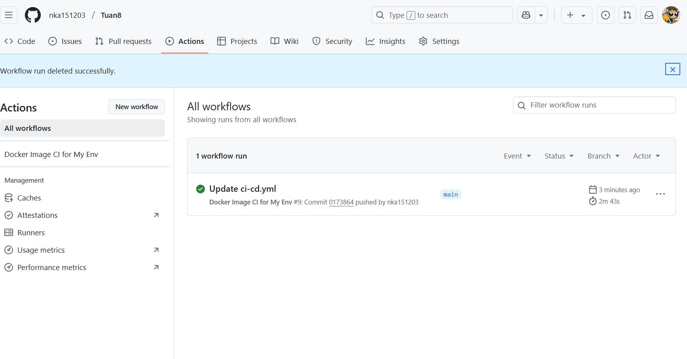
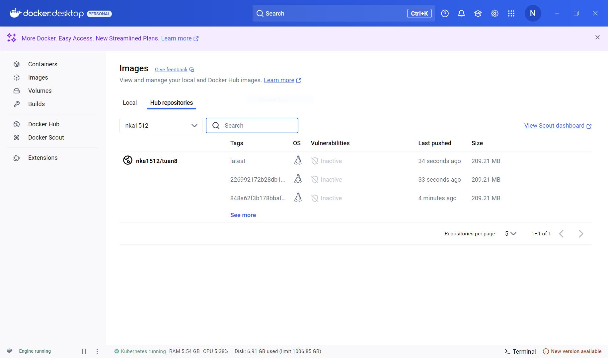
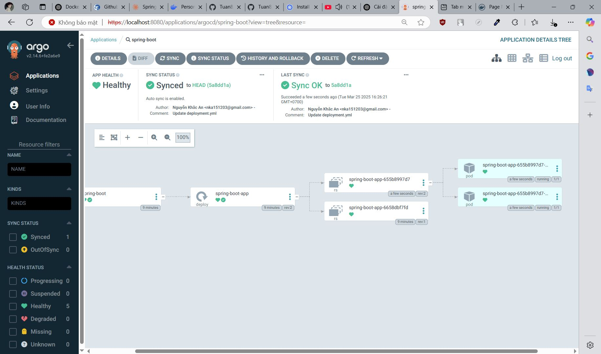

# Bài tập tuần 8
## Ngày học: 25/03/2025
## Bài tập: Github Actions and ArgoCD

## 📌 Giới thiệu
Họ và tên: Nguyễn Khắc An\
MSSV: 22024501

## 📌 Kết quả thực hiện
### 1️⃣. Thực hiện Action thành công

### 2️⃣. Tạo thành công Image trong DockerHub

### 3️⃣. Setup thành công ArgoCD

