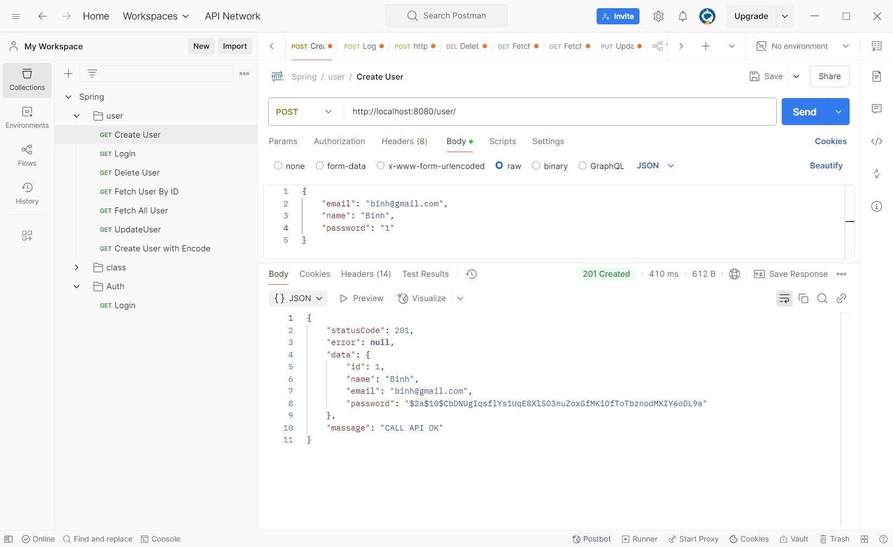
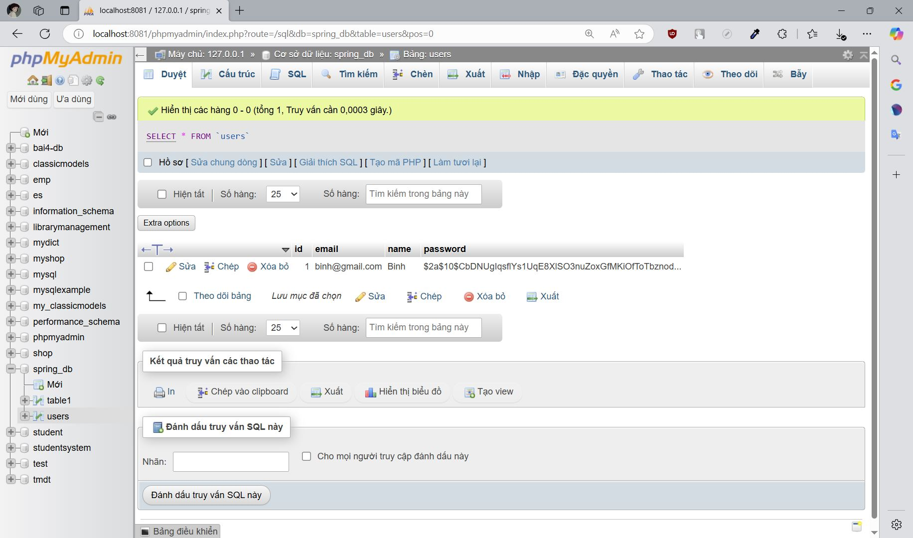
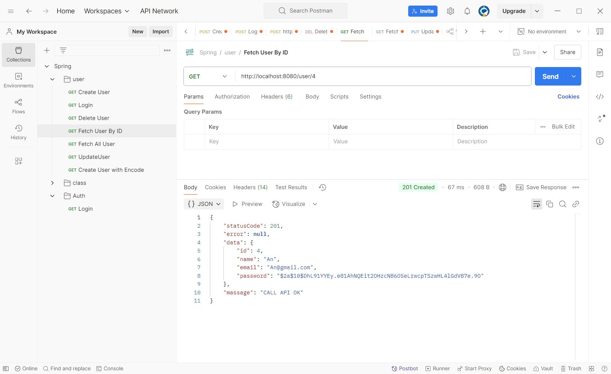
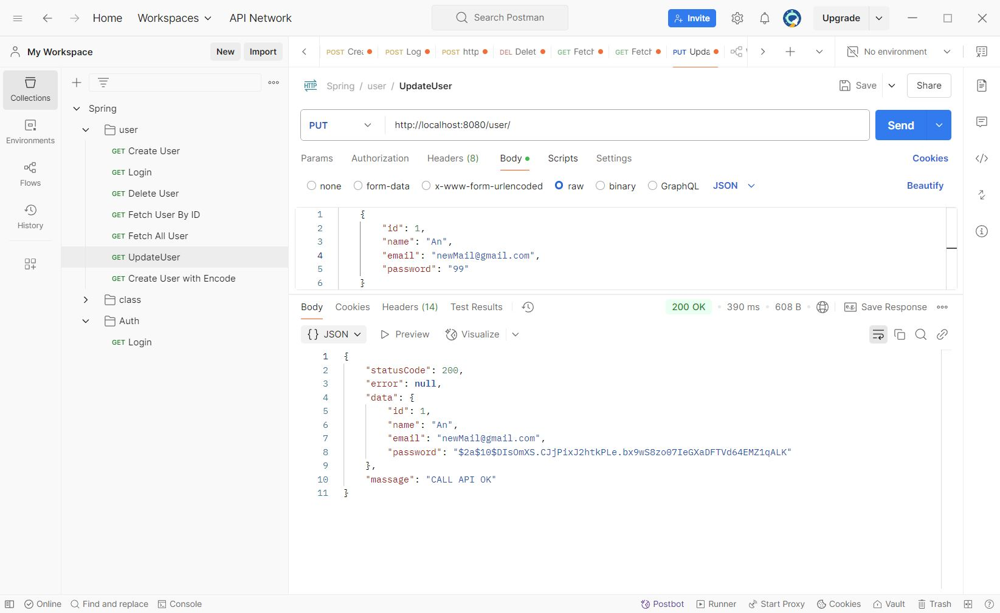
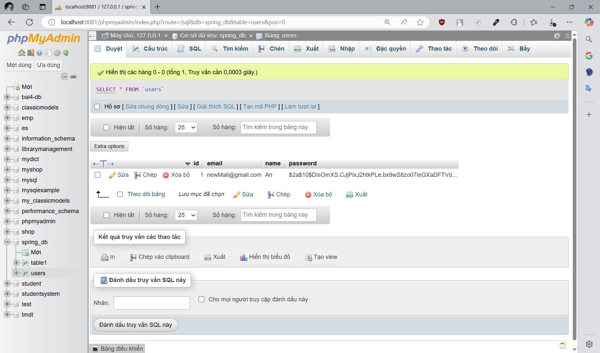
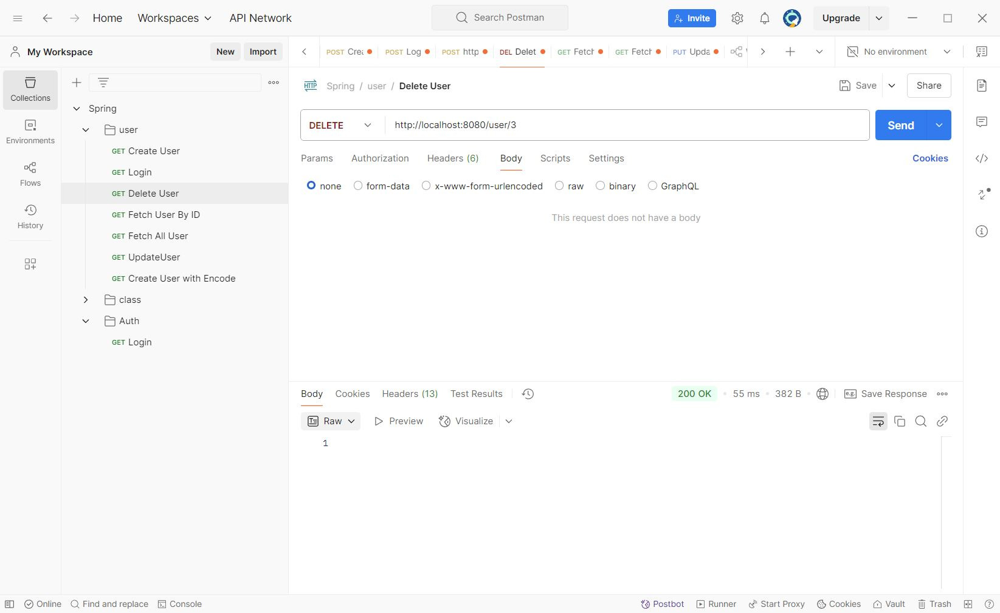
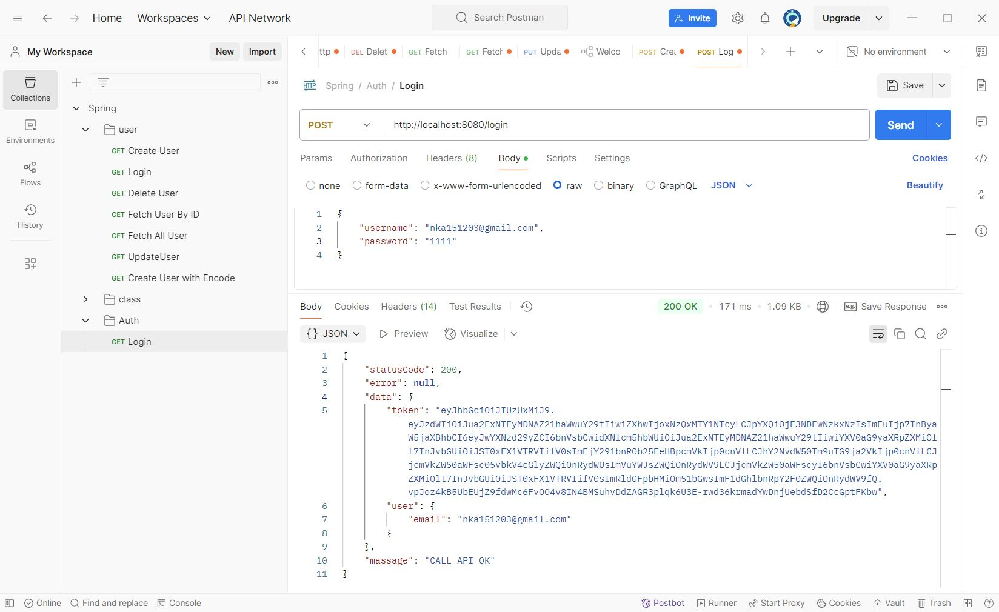

# Bài tập tuần 5
## Ngày học: 04/03/2025
## Bài tập 1: Spring Boot RESTAPI & JWT

## 📌 Giới thiệu
Họ và tên: Nguyễn Khắc An\
MSSV: 22024501

## 📌 Kết quả thực hiện
### 1️⃣. Create User
 \

### 2️⃣. Read User
 \

### 3️⃣. Update User
 \

### 4️⃣. Delete User
 \

### 5️⃣. Get Token Login 

