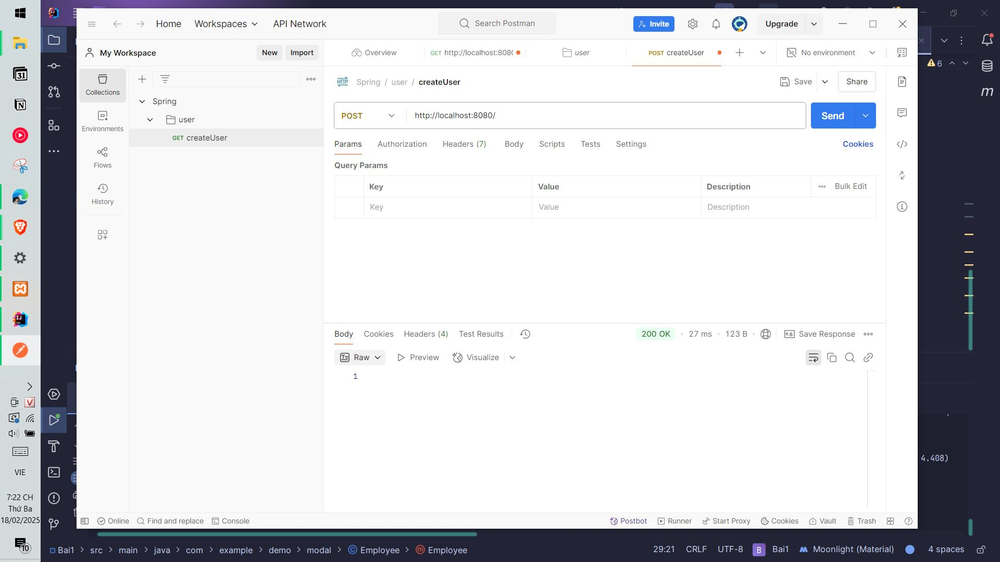
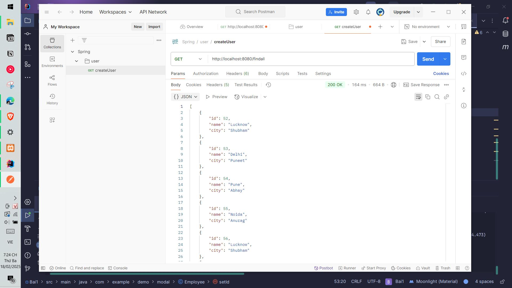
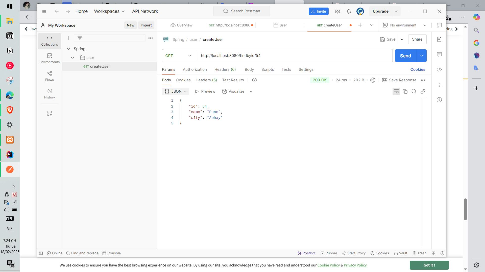

# Bài tập tuần 3
## Ngày học: 18/02/2025
## Bài tập 1: Spring Boot – Spring Data JPA 

## 📌 Giới thiệu
Họ và tên: Nguyễn Khắc An\
MSSV: 22024501

## 📌 Kết quả thực hiện
### 1️⃣. Thực hiện lưu toàn bộ nhân viên

### 2️⃣. Tìm toàn bộ nhân viên

### 3️⃣. Tìm nhân viên có id là 54

### 4️⃣. Thực hiện xóa toàn bộ nhân viên

### 5️⃣. Tìm toàn bộ nhân viên 
Thấy toàn bộ nhân viên đã được xóa

