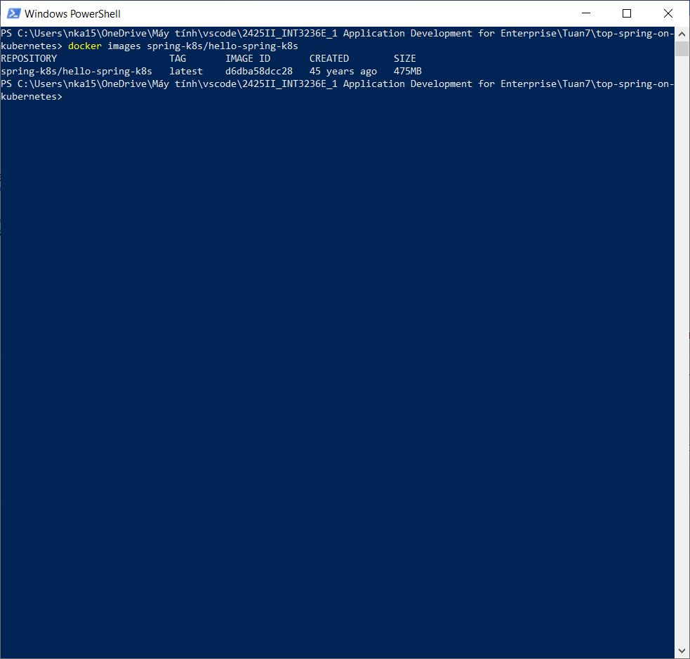
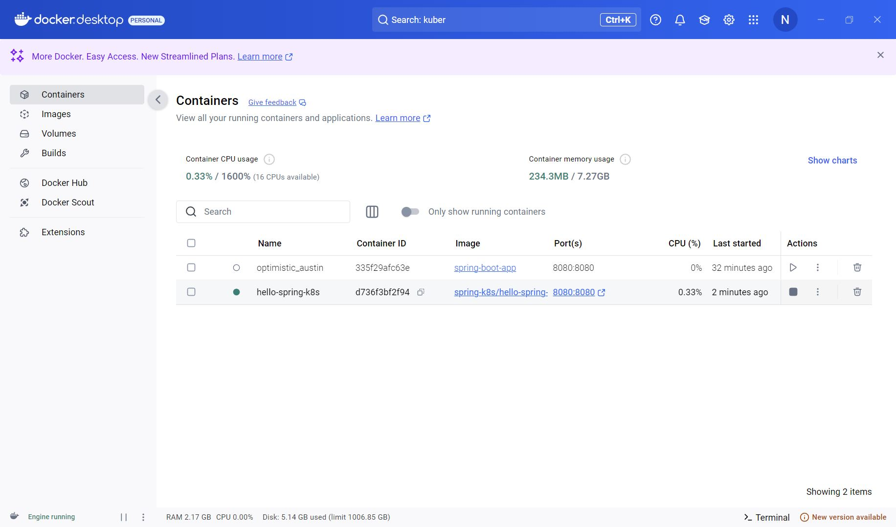
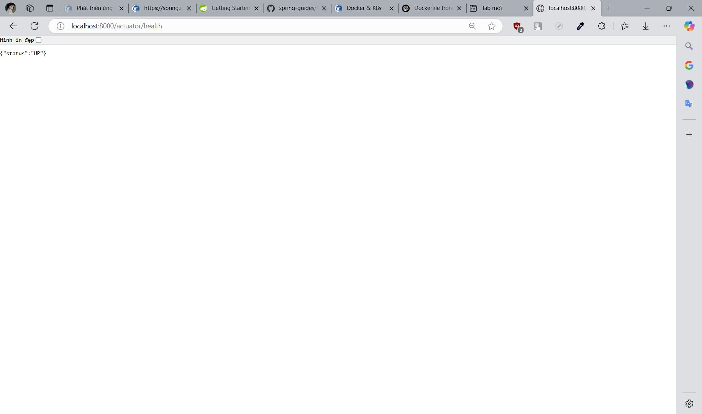
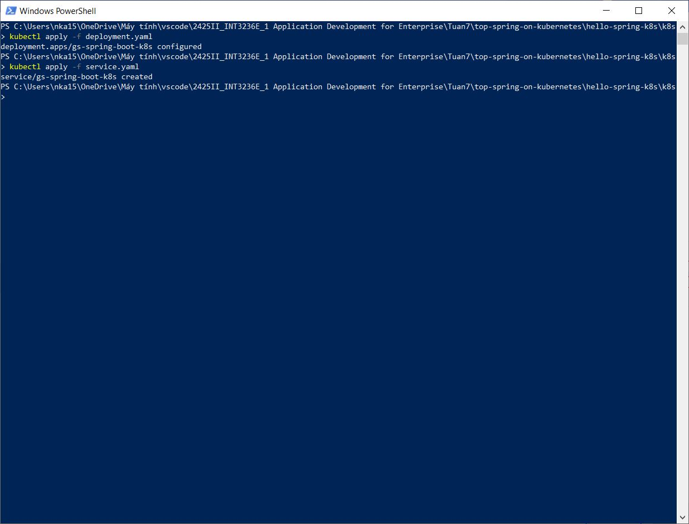
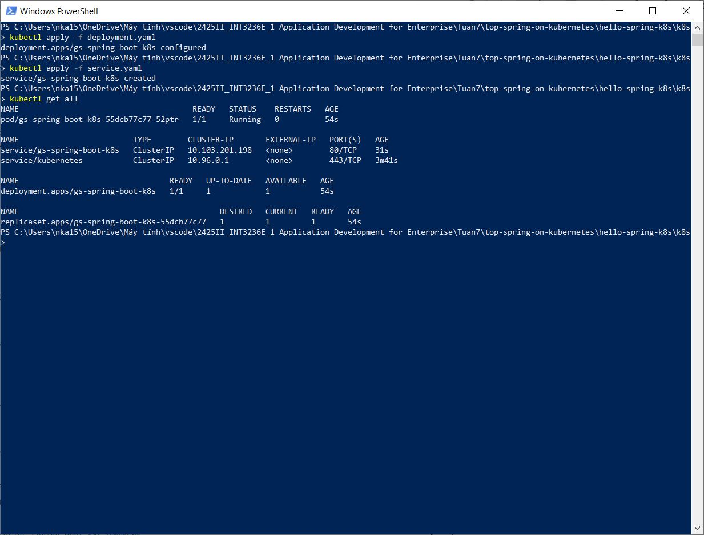
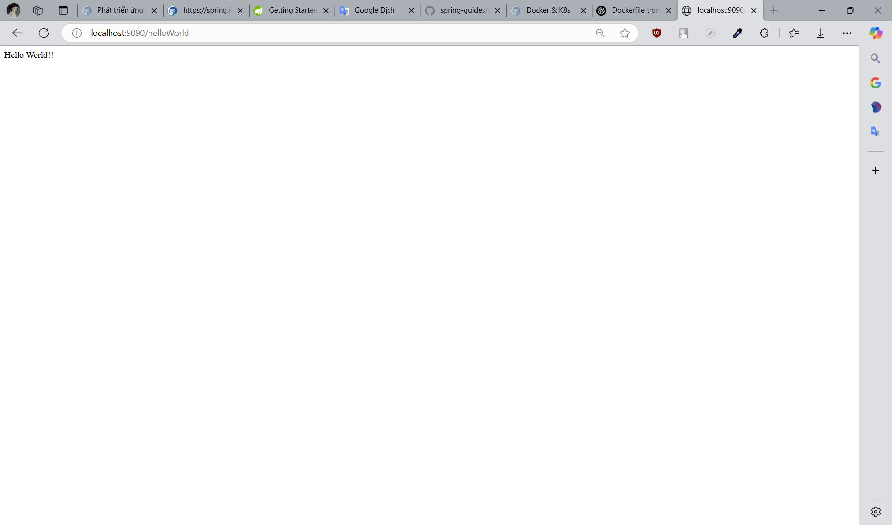

# Bài tập tuần 7
## Ngày học: 18/03/2025
## Bài tập: Kubernetes

## 📌 Giới thiệu
Họ và tên: Nguyễn Khắc An\
MSSV: 22024501

## 📌 Kết quả thực hiện
### 1️⃣. Check Image từ Cloud Native Buildpacks:

### 2️⃣. Image hiện trong Docker Desktop:

### 3️⃣. Chạy Image:

### 4️⃣. Kiểm tra [Localhost :](http://localhost:8080/actuator/health):

### 5️⃣. Áp dụng các tệp YAML vào Kubernetes:

### 6️⃣. GetAll để thấy Newly created deployment, service, and pod đang chạy

### 7️⃣. Forward Port

### 8️⃣. Forward Port thành công

